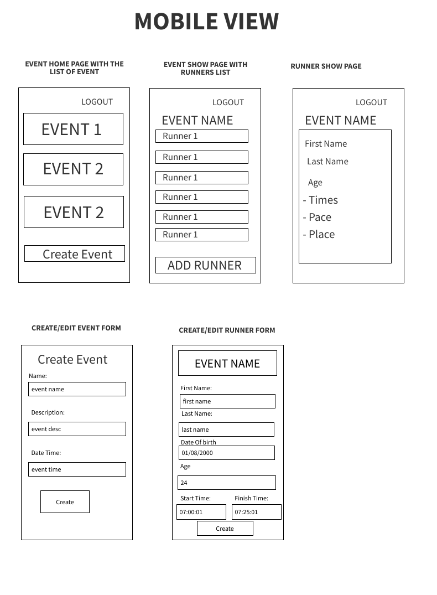

# Seal project 2

- **My name: Yuliya Buiko**
- **App Name: My Running Profile**
- **Description: Full-stack app that allows users to create a running profile which includes creating an event, adding a person/runner records to the event with their times and results and calculating pace**
- **GitHub Url: https://github.com/uliaarkadz/sealproject2.git**
- **Deployed WebSite: https://yb-seal-project-2.onrender.com/**
- **Trello Board: https://trello.com/invite/b/AbZTAT8x/ATTI149a8d15786f4e3b93e48070e28cc6baC3E22954/project2**

## List of Dependencies

##### Node Dependencies (package.json)

- express
- bcrypt
- connect-mongo
- dotenv
- ejs
- express-session
- method-override
- mongoose
- morgan

##### Frontend

- alpine
- jquery
- bootstrap
- htmx
- css

## Route Map

List of different routs and their purpose in the app

| Route Name |     Endpoint     | Metod  |                   Description                    |
| :--------: | :--------------: | :----: | :----------------------------------------------: |
|   Index    |      /event      |  Get   |          Renders all events on the page          |
|    New     |    /event/new    |  Get   |          Renders create new event form           |
|  Destroy   |    /event/:id    | Delete |                Delete event by id                |
|   Update   |    /event/:id    |  Put   |                   Update Event                   |
|   Create   |      /event      |  Post  |                Creates new event                 |
|    Edit    | /event/edit/:id  |  Get   |     Renders edit form for an existing event      |
|    Show    |    /event/:id    |  Get   |              Displays event details              |
|   Index    |     /runner      |  Get   |         Renders all runners on the page          |
|    New     |   /runner/new    |  Get   |      Renders create new runner profile form      |
|  Destroy   |   /runner/:id    | Delete |           Delete runner profile by id            |
|   Update   |   /runner/:id    |  Put   |              Update Runners profile              |
|   Create   |     /runner      |  Post  |        Creates new runners profile record        |
|    Edit    | /runner/edit/:id |  Get   | Renders edit form for an existing runner profile |
|    Show    |   /runner/:id    |  Get   |             Displays runner details              |
|    New     |   /user/signup   |  Get   |             Renders create new user              |
|   Create   |   /user/signup   |  Post  |                 Creates new user                 |
|    New     |   /user/login    |  Get   |             Renders user login page              |
|   Create   |   /user/login    |  Post  |                  Signs in user                   |
|   Logout   |   /user/logout   |  Get   |              Distroys user session               |

## Design mockups (Desktop + Mobile)

##### Mobile design

##### Desktop design

## ERD (Entity Relationship Diagram)

